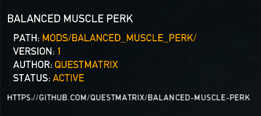

# Balanced Muscle Perk
A properly balanced fork of Dr_Newbie's [Muscle Perk Deck](https://modworkshop.net/mod/27990) mod for *PAYDAY: The Heist*.

This mod makes PD:TH significantly easier by increasing your maximum health, giving passive health regeneration, and adding a small chance for nearby enemies to immediately surrender upon firing your weapon.
## Effects
When using this mod:
- You will have 80% extra base health.
- You will passively regenerate 0.6% of your health every second.
- Each shot from your firearms has a 0.1% chance of intimidating nearby enemies, forcing them to surrender.
  - You can then yell at them to cuff themselves like normal.

You can change these numbers to be whatever you want by editing the five variables in **upgradestweakdata.lua**. This mod does not include any effects from the other Perk Deck mods.
## Installation
1. Install [DorHUD](https://modworkshop.net/mod/14267).
2. Download the latest version of the mod from the [releases](https://github.com/questmatrix/balanced-muscle-perk/releases) page.
3. Extract the zipped folder and move the **balanced_muscle_perk** folder to your PAYDAY The Heist\mods folder.
4. Make sure the module is enabled in your mod manager settings. It should look like this:

## Changes
This fork is intended to correct balancing issues with the original mod. Notably, the probability that an enemy would be intimidated upon hearing your firearm was originally 0.35 - a 35% chance. This was extremely broken with automatic weapons, leading to situations where entire rooms of enemies would immediately surrender after only a few shots had been fired. I also lowered the range at which enemies can be intimidated by firearms.

The goal of this fork is to allow for a passive health regeneration mechanic, as well as easier accumulation of new hostages via the random surrender mechanic, *without* completely trivializing gameplay as the original mod did.

This mod still has three issues that I would like to correct in the future:
1. When using the mod, a glaring blue effect will occasionally show up.
2. The probability of intimidating enemies is the same for all firearms, and applies to each individual shot fired - making automatic firearms and/or firearms with a high rate of fire perform drastically better.

The lowered probability prevents automatic firearms from being overpowered, but also means that non-automatic firearms are extremely unlikely to trigger the effect.

3. The random surrender mechanic works on special units like Bulldozers and Tasers.
